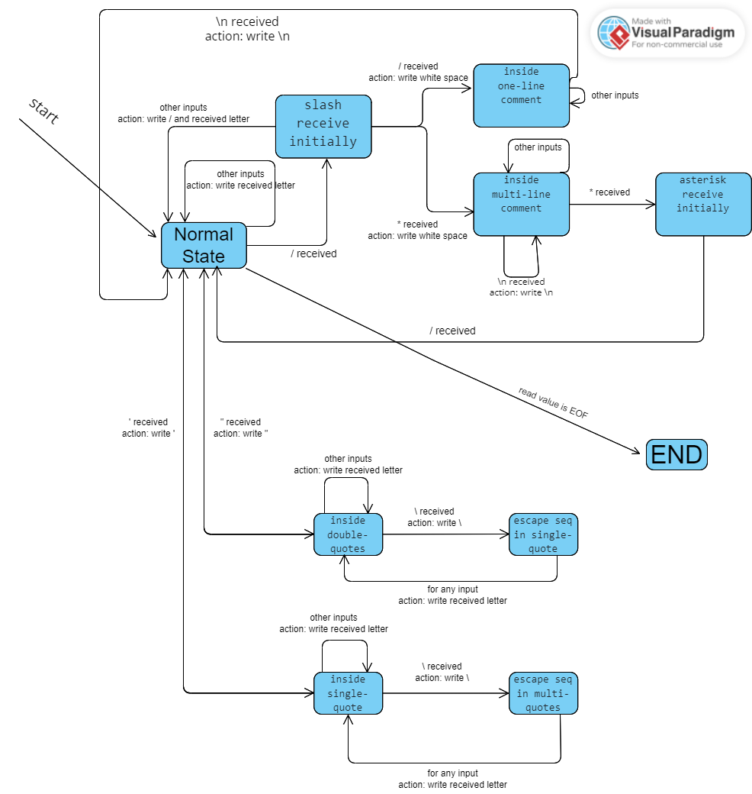
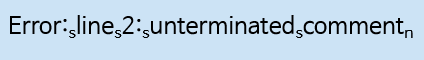

# spec

1. 각각의 주석은 공백으로 대체한다.
2. //, /\*\*/ 두 타입의 주석을 모두 처리하며, 주석 내부의 줄바꿈은 그대로 추가하여 기존 코드의 라인#을 보전하도록 처리한다.
3. 따옴표 안의 주석은 무시한다. -> 그대로 write하라는 것.
4. 따옴표 안의 \도 무시한다. -> 마찬가지
5. 따옴표 안의 newline도 무시한다. -> 마찬가지
6. 문자열이 닫히지 않으면, 에러처리하지 않음. 열린 문자열 안에서는 3, 4, 5번을 따르도록 한다.
7. 주석이 닫히지 않았다면, 닫히지 않은 주석의 라인 #과 함께 오류 메세지를 출력하고, 열린 주석을 공백으로 대체한다.
8. 실패 시 리턴값은 EXIT_FAILURE, 임의의 인풋 길이에 대한 일반적인 솔루션, 마지막 라인은 newline으로 끝난다고 생각, \뒤에 newline은 등장하지 않는다, 한 파일에 작성, getchar와 fprintf를 사용.

## 뭔가 애매한 조건들.

- 따옴표 안에 \를 무시하면, \"같은 경우를 어떻게 처리하라는건지 모르겠구만. -> 예외처리 해주는게 의도같음.
- \ + newline이 등장하지 않는다는게 무슨 뜻인지 감이 아예 안잡힘.

## 엣지케이스 & 생각할 점

- 이스케이프 문법으로 인한 "를 예외처리해주어야 한다.
- /가 입력으로 들어왔을 때, 버퍼에 잠시 넣어두고 주석인지 아닌지 확인 후에 write.

# State Transition Diagram

## States

0. normal
1. inside one-line comment
2. inside multi-line comment
3. inside of double-quotes
4. ASTERISK_RECEIVED_INITIALLY_IN_COMMENT,
5. inside of single-quote
6. receive / from normal state
7. escape sequence in single-quote
8. escape sequence in double-quotes

## Diagram

# STD -> Implement

- states: ENUM으로 정의
- 메인 함수에서는 state = handleStateTransition(state, input)
- handleStateTransition에서 transitionState(state, input)과 executeAction(state, input)을 실행.
- transitionState에서 현재 state랑 input을 동시에 조건문으로 다루면 코드가 지저분해지겠죠?
  - transitionFromXXXState를 정의하자
  - executeAction도 마찬가지로 executeActionFromXXXState
- 종료 시점의 state이 multi-line comment 안일 경우에 오류를 내보내준다.
- 이떄 오류 정보는 Std error stream으로 

제출 전에 검토 사항

- 주석
- 한 라인의 글자 수 제한 확인
